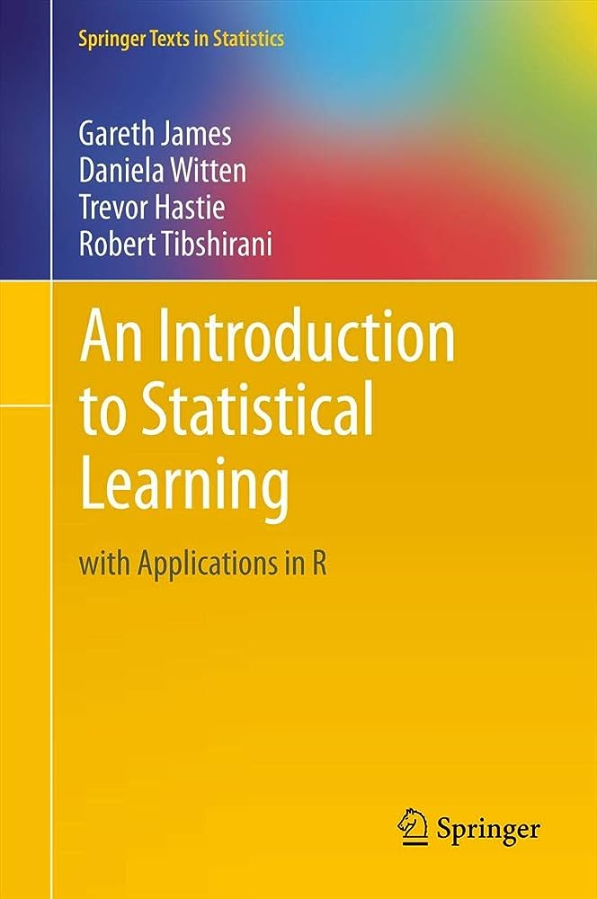

# CINF 624: Predictive Modeling (3 Credits)

**Semester:** Spring 2024

**Day/Time:** Tuesdays 3 pm until 5:50 pm

**Location:** 	ETEC 368 

**Instructor:** M. Abdullah Canbaz, Ph.D. *\[ he/him/his \]*

**Contact:** (518) 442 – 5258

**Office Hours:** Wednesdays 2:00 pm – 4:00 pm (online) or by appointment

## Course Description:

Fundamental concepts and techniques to discover patterns in data,
identify variables with predictive power, and develop predictive models.
Topics include statistical, data mining, and machine learning concepts
and methods: data selection, representation, cleaning, and
preprocessing; algorithms such as classification, clustering, and
association rules; advanced techniques such as deep learning; and text
and web mining. Best practices on the selection of methods and tools to
build predictive models.

## Course Learning Outcomes:

By the end of this course, students will be able to:

1.  Formulate predictive analytics questions.

2.  Select the appropriate method for predictive analysis, and how to
    build effective predictive models.

3.  Search, identify, gather and preprocess data for the analysis.

4.  Evaluate the soundness, appropriateness and validity of their models
    and how to interpret and report on results for a management
    audience.

5.  Apply specific statistical and regression analysis methods
    applicable to predictive analytics to identify new trends and
    patterns, uncover relationships, create forecasts, predict
    likelihoods, and test predictive hypotheses.

6.  Develop and use various quantitative and classification predictive
    models based on various regression and decision tree methods.

7.  Use popular tools and software used in industry for predictive
    analytics, especially R, R Studio and R Markdown.

## Prerequisites:

EMH 650 or a graduate-level statistics course.

## Grading:

This course is A-E graded and the grades are determined based on graded
assignments, which other than the final project, is due on the Sunday of
that week by 11:59pm via Brightspace.

The entire course is structured around a semester-long predictive
modeling project. To emulate the types of workflows found in the data
analytics community, each student will be provided with a specific
question or task for which they will need to build one or more
predictive models to address the request. The assignments for the
semester follow a progressive track through the modeling project, from
project plans all the way to final briefings. Each of the components are
listed below and discussed more in detail.

1)  Initial Project Plan (10%)

2)  DGP / Bias Check (15%)

3)  Descriptive Analysis (25%)

4)  Final Analysis / Write-Up (40%)

5)  Project Replicability Assessment (10%)

> **Initial Project Plan –** Students will be required to write a 1-page
> outline of their project plan; specifically, how they are going to
> address the task they have been provided, and what they need to do in
> each of the subsequent phases of the project.
>
> **DGP / Bias Check –** In this assignment, students will be required
> to review their project plan and their data sources to identify areas
> within the data generating process (DGP) or in the collection process
> of the data that might systematically influence the conclusions one
> could receive from the analysis of the data. For example, if the task
> is to build a predictive model of airplane arrival times, a DGP check
> might identify that the data used in the analysis doesn’t include
> cargo plane arrival times, or only focuses on domestic rather than
> domestic and international flights. Understanding the DGP and its
> potential for biasing results is an important part of building
> predictive models.
>
> **Descriptive Analysis –** In this step, students will conduct an
> initial descriptive analysis of their data supporting the task they
> have been assigned. This may include tables, charts, and even key
> classifications of their data that will help inform their underlying
> predictive model. This section is part exploration and part
> conceptualization and will help the students better understand their
> data and potential pitfalls in its application.
>
> **Initial Model Build –** In this step, students will conduct their
> initial predictive model analysis, writing up both the code for the
> model build and the analysis of the results. Students will also
> identify any potential problems with the initial model and conduct /
> document modifications made in response to those problems identified.
>
> **Initial Model Demonstration –** As part of the initial model build,
> students will also need to create a rehearsed (i.e. practiced) screen
> casting of their model build, running, assessment, and modifications
> as documented in the Initial model build. The idea here is for the
> students to not only be able to generate and run a series of code for
> their analysis, but also be able to lead others (through a screen
> casted video that captures their voice as an audio) in how to build
> and assess the initial model.
>
> **Final Analysis / Write-Up –** As a final output for their modeling
> efforts, students will need to complete a final analysis and write up
> of their modeling efforts in professional format, including
> introduction, assumption, data sources, descriptive analyses, model
> building, and out-of-sample validation. The product will also include
> an executive summary of no more than 1 single-spaced page, designed to
> help the students concisely communicate their results to a broader
> audience.
>
> **Final Briefing –** Students will be required to record a final
> briefing of their project and analysis, narrated by the students and
> with no more than 10 slides or 10 minutes.
>
> **Project Replicability Assessment –** After the conclusion of all the
> class deliverables, the students will also be assessed on the ability
> for their models and approaches to be replicated by individuals
> outside the course. This will consist of clear, commented code briefly
> describing the analysis at each step, hosting the project code in a
> public repository (like GitHub) with version control, and whether the
> entire code can be run without debugging. The professor will run the
> code as is to ensure it is replicable outside the student’s efforts.
> This is not a separate assignment that students will have to submit
> but will be assessed at the end of the semester based on what the
> students have produced during the semester.

**Labs –** The course text and videos that we are using for this
semester provide a number of labs putting into practice the material
from that week’s topic. These labs have videos associated with them, and
use data that is provided on the Brightspace page. These labs are
extremely helpful, and it is strongly encouraged that the students
complete each of the labs and walkthrough with the associated videos.
Since the solutions are provided, the labs are not a graded element of
the course.

Your final grade will be based on a scale of 100 points:

| **A**  | **A-** | **B+** | **B** | **B-** | **C+** | **C** | **C-** | **D+** | **D** | **D-** | **E** |
|--------|--------|--------|-------|--------|--------|-------|--------|--------|-------|--------|-------|
| 100-94 | 93-89  | 88-85  | 84-82 | 81-79  | 78-76  | 75-73 | 72-70  | 69-67  | 66-64 | 63-60  | 59-0  |

**Required Readings:** There is only one book required for this class:

> James, Gareth, Daniela Witten, Trevor Hastie, and Robert Tibshirani.
> 2013. [***An Introduction to Statistical Learning with Applications in
> R***](https://hastie.su.domains/ISLR2/ISLRv2_corrected_June_2023.pdf).
> Springer: New York, NY.
>
> Additional readings will be posted Brightspace and are listed in the
> schedule.

**Software Packages:**

R Studio and associated packages

**BrightSpace Use:**

Students will complete class work and assignments independently using
the Brightspace Learning System (BLS). If they are not familiar with
Brightspace, they may please visit the Brightspace help pages for
students:
<https://wiki.albany.edu/display/public/askit/Brightspace+Resources+for+Students>

## Course Outline:

**\*IMPORTANT:** It is highly recommended that you double checking with
the live course as the instructor may update materials and dates
throughout the semester. \*

<table>
<colgroup>
<col style="width: 8%" />
<col style="width: 10%" />
<col style="width: 37%" />
<col style="width: 1%" />
<col style="width: 16%" />
<col style="width: 26%" />
</colgroup>
<thead>
<tr class="header">
<th><strong>Week</strong></th>
<th><strong>Date</strong></th>
<th><strong>Topics</strong></th>
<th colspan="2"><strong>Labs</strong></th>
<th><strong>Notes</strong></th>
</tr>
</thead>
<tbody>
<tr class="odd">
<td>1</td>
<td>23-Jan</td>
<td>Welcome to Course, <a href="https://drcanbaz.com/teaching/CINF624/SP24/slides/RforeveryonebyLanderJared.pdf"> Introduction to R </a></td>
<td colspan="2"> </td>
<td> </td>
</tr>
<tr class="even">
<td>2</td>
<td>30-Jan</td>
<td>Advanced R Programing  - <a href="https://towardsdatascience.com/four-r-packages-for-automated-exploratory-data-analysis-you-might-have-missed-c38b03d4ee16"> Automated Exploratory Data Analysis</a></td>
<td colspan="2"> </td>
<td> </td>
</tr>
<tr class="odd">
<td>3</td>
<td>6-Feb</td>
<td>Statistical Learning, Linear Regression</td>
<td colspan="2">#1, #2</td>
<td> </td>
</tr>
<tr class="even">
<td>4</td>
<td>13-Feb</td>
<td>Classification - 1</td>
<td colspan="2">#3</td>
<td>Initial Project Plan </td>
</tr>
<tr class="odd">
<td>5</td>
<td>20-Feb</td>
<td>Classification - 2</td>
<td colspan="2">#4,#5</td>
<td> </td>
</tr>
<tr class="even">
<td>6</td>
<td>27-Feb</td>
<td>Resampling Methods</td>
<td colspan="2">#6, #7</td>
<td> </td>
</tr>
<tr class="odd">
<td>7</td>
<td>5-Mar</td>
<td>Linear Model Selection and Regularization</td>
<td colspan="2">#8, #9, #10, #11</td>
<td>DGP / Bias Check </td>
</tr>
<tr class="even">
<td>8</td>
<td>12-Mar</td>
<td>Midterm Exam</td>
<td colspan="2"> </td>
<td> </td>
</tr>
<tr class="odd">
<td> </td>
<td>19-Mar</td>
<td>Spring Break</td>
<td colspan="2"> </td>
<td> </td>
</tr>
<tr class="even">
<td>9</td>
<td>26-Mar</td>
<td>Moving Beyond Linearity</td>
<td colspan="2">#12, #13</td>
<td> </td>
</tr>
<tr class="odd">
<td>10</td>
<td>2-Apr</td>
<td>Tree-Based Methods, Support Vector Machines</td>
<td colspan="2">#14, #15, #16, #17</td>
<td>Descriptive Analysis </td>
</tr>
<tr class="even">
<td>11</td>
<td>9-Apr</td>
<td>Unsupervised Learning</td>
<td colspan="2">#18, #19, #20</td>
<td> </td>
</tr>
<tr class="odd">
<td>12</td>
<td>16-Apr</td>
<td>Advanced Statistical Learning</td>
<td colspan="2">#21</td>
<td> </td>
</tr>
<tr class="even">
<td>13</td>
<td>23-Apr</td>
<td colspan="3">
Buffer for Class Makeup or Work on Final Project 

 
</td>
<td>Initial Model Build </td>
</tr>
<tr class="odd">
<td>14</td>
<td>30-Apr</td>
<td colspan="2">Final Project Presentations</td>
<td> </td>
<td>Last Day of SP Semester</td>
</tr>
<tr class="even">
<td>15</td>
<td colspan="4">Final Exam Day</td>
<td>Final Reports Due by 11:59pm</td>
</tr>
</tbody>
</table>

## iCEHC Showcase

CEHC Showcase was designed as an opportunity for students within the
information, informatics, game design and development, emergency
management, homeland security and cybersecurity fields to highlight and
present interesting projects, research, and concepts they are learning
within their courses. It also provides students with an opportunity to
showcase their findings to others and develop highly desired
presentation and people skills. The CEHC Showcase is on April 30. All
students in CINF 624 are expected to present at this event and should
reserve that time in their schedule. Those who present their work in the
showcase will be granted 3 points (3%) of the overall grade.

## Policies:

**Attendance Policy:** This is an asynchronous fully online course, and
therefore there are no specified class sessions where attendance will be
taken. Course progression will be measured by completion of the required
assignments and exams, and there is no grade given for participation or
attendance.

**Missed Exams and Assignments:** Students missing an examination or
exercise due to illness or personal/family emergencies will be excused
provided that you notify the professor via email on the day of the
absence or earlier that the absence meets university policies on excused
absences ([see the
link](https://www.albany.edu/undergraduate_bulletin/regulations.html)),
and that required documentation is submitted to the professor at the
next class session. Any assignments missed due to a documented and
approved absence will need to be made up within one week of the absence,
and it is the student’s responsibility to coordinate with the professor
to make up the assignment within that time period.

**Absence due to religious observance:** New York State Education Law
(Section 224-a) - Campuses are required to excuse, without penalty,
individual students absent because of religious beliefs, and to provide
equivalent opportunities for make-up examinations, study, or work
requirements missed because of such absences. You will be required to
notify the professor **at least three days prior** to the religious
observance that you will not be able to complete the assignment, and
then an alternative date or accommodation will be made.

**Disability Policy:** Reasonable accommodations will be provided for
students with documented physical, sensory, systemic, medical,
cognitive, learning and mental health (psychiatric) disabilities. If you
believe you have a disability requiring accommodation in this class,
please notify [Disability Access and Inclusion Student
Services](mailto:Disability%20Access%20and%20Inclusion%20Student%20Services)
(518- 442-5501; daiss@albany.edu). Upon verification and after the
registration process is complete, the DAISS will provide you with a
letter that informs the course instructor that you are a student with a
disability registered with the DAISS and list the recommended reasonable
accommodations. You can review the [Equity and Compliance
website](https://www.albany.edu/equity-compliance) as well for
additional information.

**Extra Credit: Extra credit can be earned in a number of ways. All require consultation with the instructor before they are commenced. All extra-credit opportunities are capped at no more than 3 points (3%) of your overall grade.**

- *Community:* CEHC sponsors several events throughout the semester. Any
  student who attends one or more of those events may receive extra
  credit. Details about specific qualifying events will be made
  available in advance.

- Other extra credit opportunities may be available. Details to follow.

**Withdrawal from the Course:** The drop date for the Fall 2023 semester
is Wednesday, November 1st for graduate students. That is the last date
you can drop a course and receive a 'W'. It is your responsibility to
take action by this date if you wish to drop the course. In particular,
grades of "incomplete" will not be awarded to students because they
missed the drop deadline.

**Incomplete Policy:** A tentative grade is given only when the student
has nearly completed the course but due to circumstances beyond the
student's control, the work is not completed on schedule. The date for
the completion of the work is specified by the instructor. The date
stipulated will not be later than one month before the end of the
session following that in which the Incomplete is received. The grade I
is automatically changed to E or U unless work is completed as agreed
between the student and the instructor.

**Academic Integrity: It is every student’s responsibility to become familiar with the standards of academic integrity at the University. Claims of ignorance, of unintentional error, or of academic or personal pressures are not sufficient reasons for violations of academic integrity. See <http://www.albany.edu/undergraduate_bulletin/regulations.html>**

Coursework and examinations are considered individual exercises. Copying
the work of others is a violation of university rules on academic
integrity.  Individual coursework is also key to your being prepared and
performing well on tests and exams. Forming study groups and discussing
assignments and techniques in general terms is encouraged, but the final
work must be your own work. **For example, two or more people may not
create an assignment together and submit it for credit. Credit will not
be given for identical final project reports with different color
palettes used on graphs submitted by two or more people.** If you have
specific questions about this or any other policy, please ask.

The following is a list of the types of behaviors that are defined as
examples of academic dishonesty and are therefore unacceptable. Attempts
to commit such acts also fall under the term academic dishonesty and are
subject to penalty. No set of guidelines can, of course, define all
possible types or degrees of academic dishonesty; thus, the following
descriptions should be understood as examples of infractions rather than
an exhaustive list.

- Plagiarism

- Allowing other students to see or copy your assignments or exams

- Examining or copying another student’s assignments or exams

- Lying to the professor about issues of academic integrity

- Submitting the same work for multiple assignments/classes without
  prior consent from the instructor(s)

- Getting answers or help from people, or other sources (*e.g.* research
  papers, web sites) without acknowledging them.

- Forgery

- Sabotage

- Unauthorized Collaboration (just check first!)

- Falsification

- Bribery

- Theft, Damage, or Misuse of Library or Computer Resources

*Any* incident of academic dishonesty in this course, no matter how
"minor" will result in

- No credit for the affected assignment.

- A written report will be sent to the appropriate University
  authorities (*e.g.* the Dean of Undergraduate Studies)

- One of -

  - A final mark reduction by *at* *least* one-half letter grade (*e.g.*
    B → B-, C- → D+),

  - A Failing mark (E) in the course, and referral of the matter to the
    University Judicial System for disposition.

- 

**Copyright Policy:** Materials provided to you as part of this course
are provided under Fair Use and the TEACH Act. These materials are
provided for your educational use only and should not be shared,
reposted, or further distributed. In addition, all materials and
documents developed for this course are copyright protected and may not
be reproduced or distributed without express written permission.
Finally, you must follow appropriate citation practices for materials
you reference in your work for this course. If you have questions,
please ask.

**Responsible Use of Information Technology:**
<https://wiki.albany.edu/display/public/askit/Responsible+Use+of+Information+Technology+Policy>

**Style Manual and Guidelines**: Written assignments should be
word-processed and double-spaced. Students are required to cite sources,
if any are used in their written work, according to the American
Psychological Association (APA).  

 

American Psychological Association. *2020. Publication manual of the
American Psychological Association*, 7th Edition. Washington, DC:
American Psychological Association. 

Style manuals are available in the reference sections of many mainstream
bookstores and reference sections of all 3 of the University Libraries.
(BF 76.7 P83 2020) 

[Purdue
OWL](https://owl.purdue.edu/owl/research_and_citation/apa_style/apa_formatting_and_style_guide/general_format.html) provides
guidance the construction of citations in APA style. It is based on the
7th edition of the Publication manual of the American Psychological
Association. Individuals in the social science disciplines primarily use
this style
guide. <https://owl.purdue.edu/owl/research_and_citation/apa_style/apa_formatting_and_style_guide/reference_list_books.html> 

## Time Management: For every credit hour that a course meets, students should expect to work 3 additional hours outside of class every week (3 x 3= 9). For a three-credit course, you should expect to work 9 hours outside of class every week. Manage your time effectively to complete readings, assignments, and projects.

**Instructor Availability**: The instructor will be available for
student consultation during office hours, by appointment, and online in
Brightspace. Students are expected to check Brightspace messages
(internal) at least once every day to see whether the instructor is
trying to reach them. Students should not assume that instructor is
online 24 hours a day, 7 days a week, to answer your questions
immediately (even though the instructor will try to do so as much as
possible).

**Courtesy** In class (online) discussions the instructor and students
are expected to demonstrate professional behavior. This means
cooperating and interacting in a courteous, supportive, and tactful
manner based on mutual respect for each other's ideas.

**Students and professor should be professional at all time. Faculty
should be addressed as Prof. XXX or Dr. XXX. Emails should be addressed
“Dear…” and end with a “Thank you.” *Disrespect in any form in any CEHC
class will not be tolerated.***

**Respect for Diversity:** It is my intent that students from all
diverse backgrounds and perspectives be well served by this course, that
students’ learning needs be addressed both in and out of class, and that
the diversity that students bring to this class be viewed as a resource,
strength and benefit. It is my intent to present materials and
activities that are respectful of diversity: gender, sexuality,
disability, age, socioeconomic status, ethnicity, race, and culture.
Your suggestions are encouraged and appreciated. Please let me know ways
to improve the effectiveness of the course for you personally or for
other students or student groups. In addition, if any of our class
meetings conflict with your religious events, please let me know so that
we can make arrangements for you.[^1]

## Additional Information

**CEHC Grievance Policy & Procedure:**

According to the CEHC Grievance Policy:

1.  **… a “grievance” shall include any** complaint alleging wrongdoing
    made by students, faculty, staff, or administrators in the College
    of Emergency Preparedness, Homeland Security and Cybersecurity
    (CEHC) against other students, faculty, staff or administrators.
    “Faculty” shall include any individuals with appointments enabling
    them to be designated instructors of record, and “students” shall
    include any enrolled students.

> A “grievance” shall include, but not be limited to, any challenge to
> the resolution of a dispute over matters of academic honesty (such as
> plagiarism and cheating) and professional ethics or grades assigned
> for courses. It shall also include any allegation of improper
> treatment, including improper treatment on the grounds of age, color,
> creed, disability, marital status, military status, national origin,
> race, sex, gender identity, or sexual orientation. In grievances
> concerning grades, grievances may be filed only as to any final grade
> or other final disposition for a course. Dropping of a course shall
> constitute a final disposition for a course so as to allow grievances
> over grades or other matters occurring prior to the “drop.”
>
> All grievances concerning grades must be adjudicated by the CEHC
> grievance committee and process. All other grievances may be referred
> to the University-level community standards process (or other
> appropriate process). Nothing in this policy prohibits the aggrieved
> party from pursing University-level adjudication at any time.

2.  **Any grievance must be filed within five months** of the time the
    complainant was informed of the matter which is the subject of the
    grievance. “File” shall mean the submission of a statement from the
    complainant to either the Dean of the CEHC or the Chair of the CEHC
    Grievance Committee. The statement shall 1) detail the event or
    events to which the complainant is objecting, 2) identify the person
    or persons the complainant alleges is responsible, and 3) identify
    the remedy or remedies sought to address the complaint.

For the full CEHC Grievance Policy, please contact cehc@albany.edu.

[^1]: Respect for Diversity statement from
    <https://www.brown.edu/sheridan/teaching-learning-resources/inclusive-teaching/statements>
